<div align="center">

# CampusCare AI

### An intelligent campus companion for Lovely Professional University

**A full-stack campus community platform — events, clubs, opportunities, a working service desk,
a people & research directory, live institutional analytics, and a privacy-first AI assistant
that runs entirely on the user's own device.**

[](https://go.dev)
[](https://nextjs.org)
[](https://react.dev)
[](https://www.typescriptlang.org)
[](https://tailwindcss.com)
[](https://www.postgresql.org)
[](https://gin-gonic.com)
[](.github/workflows/ci.yml)
[](#license)

[](https://goreportcard.com/report/github.com/phanindra267/CampusFlow-Ai)
[](https://github.com/phanindra267/CampusFlow-Ai/commits/main)
[](https://github.com/phanindra267/CampusFlow-Ai)

</div>

---

## Table of Contents

- [Overview](#overview)
- [Screenshots](#screenshots)
- [Key Features](#key-features)
- [Architecture](#architecture)
- [Technology Stack](#technology-stack)
- [Quick Start](#quick-start)
- [Detailed Setup](#detailed-setup)
- [Configuration](#configuration)
- [Usage Examples](#usage-examples)
- [Project Structure](#project-structure)
- [API Reference](#api-reference)
- [Database & Migrations](#database--migrations)
- [Frontend Guide](#frontend-guide)
- [Testing](#testing)
- [Deployment](#deployment)
- [Security](#security)
- [Design Principles](#design-principles)
- [Known Gaps & Limitations](#known-gaps--limitations)
- [Roadmap](#roadmap)
- [Contributors](#contributors)
- [License](#license)
- [Acknowledgements](#acknowledgements)

---

## Overview

### The Problem

University students typically discover campus life through scattered notice boards, group chats and
a walk to the administrative block. Event registrations are manual, club discovery is invisible,
opportunities expire unnoticed, and a broken Wi-Fi login or a lost hostel pass means queueing at a
desk. Information exists; it simply is not findable at the moment it is needed.

### The Solution

**CampusCare AI** is a single, role-aware campus platform that unifies the campus lifecycle:

- **Discover** — browse and register for events, find and join clubs
- **Participate** — join discussions, reply to threads, follow clubs
- **Progress** — find internships, research assistantships and scholarships, apply and track
- **Get help** — file a service ticket, follow its timeline, rate the resolution
- **Connect** — a people directory with research-interest matching
- **Ask** — an AI assistant that streams answers without a single byte leaving your device

### Scope & Positioning

This is deliberately a **community and campus-life platform**, not an academic management system.
There are no marks, grades, or attendance-for-grading records anywhere in the schema or the API.
A member profile is self-reported and exists only to help people find relevant events,
opportunities and research collaborators.

There is also **no `FACULTY` role**. Roles are `MEMBER`, `ORGANIZER`, `ADMIN` and `SUPER_ADMIN`.

### Project at a Glance

| Metric | Value |
| --- | --- |
| REST endpoints | **117** across 9 route groups |
| Database tables | **48** active (after a deliberate pruning migration) |
| Migrations | **37** up, **9** down |
| Go code | ~**11,600** LOC across **61** files |
| TypeScript / TSX | ~**4,600** LOC across **34** files |
| SQL | ~**2,500** LOC |
| Repositories (data access) | **13** |
| Frontend routes | **15** (10 member + 4 admin + login) |
| Test suites | **7**, all passing |
| CI pipeline | GitHub Actions — build, vet, test, typecheck, lint, build |

---

## Screenshots

> The images below are **placeholder frames** with the correct aspect ratio, so this README renders
> cleanly today. To replace them with real captures, follow
> [`docs/SCREENSHOTS.md`](docs/SCREENSHOTS.md) — it lists every filename, the route to capture, the
> viewport to use, and the seed account to sign in with. All architecture diagrams below are
> committed SVGs and render immediately with no tooling.

### Login

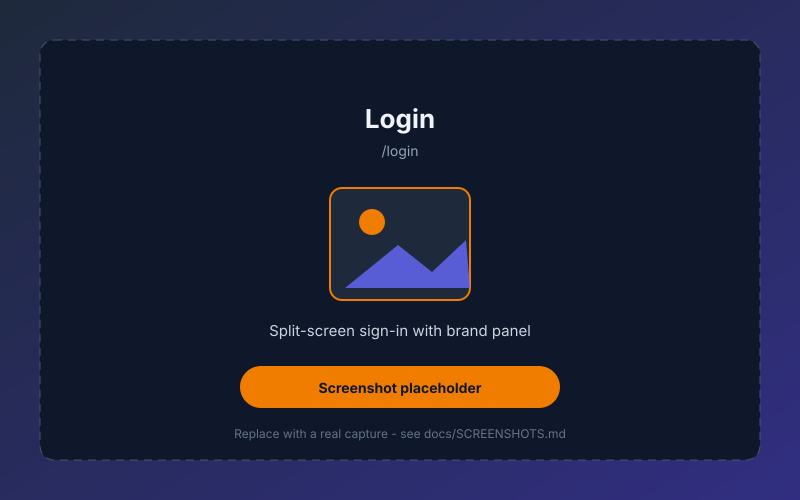

### Member Dashboard

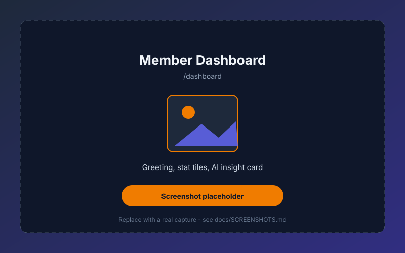

### Admin Overview

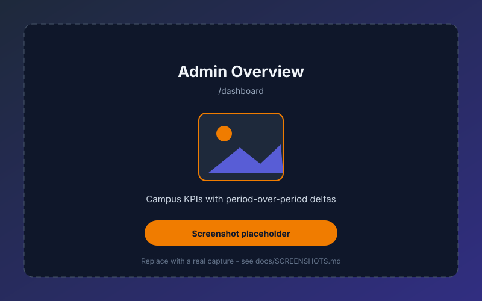

### AI Assistant


| Discover | Community | Career Hub |
| :---: | :---: | :---: |
|  | 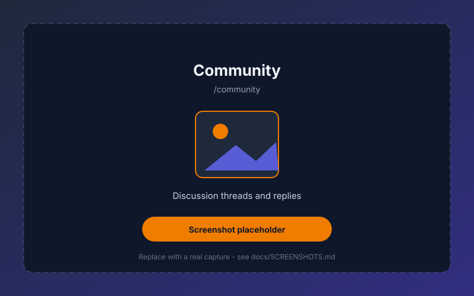 |  |

| Campus Services | Notifications | Profile |
| :---: | :---: | :---: |
|  | 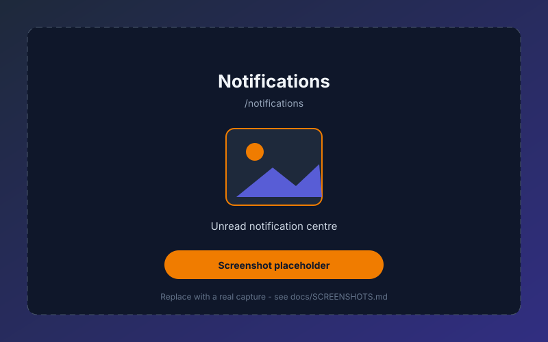 |  |

### Admin Consoles

| Operations | Analytics | Approvals |
| :---: | :---: | :---: |
| 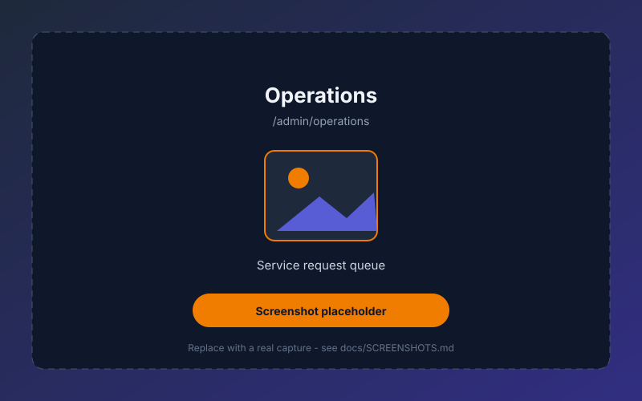 |  |  |

### Responsive Design


---

## Key Features

### Authentication & Sessions

| Capability | Implementation |
| --- | --- |
| Email + password | bcrypt hashing, constant-time comparison |
| Google OAuth 2.0 | Email + profile scopes, CSRF `state` with a 10-minute TTL |
| OTP login | Request/verify pair with a 5-minute store TTL |
| Access tokens | HS256 JWT carrying `userID`, `role`, `issuer`, `exp` — default 24h TTL |
| Refresh tokens | Rotating opaque tokens — default 30-day TTL |
| Silent refresh | The client refreshes on any `401` and retries the original request exactly once |
| Concurrent requests | In-flight refresh deduplication prevents parallel requests from burning the token |
| Multi-tab | `useSyncExternalStore` + the `storage` event propagate sign-out across tabs |

> Registration **always** provisions the `MEMBER` role. A client-supplied role field is accepted
> for backwards compatibility but ignored — elevated privileges are granted out of band by an
> administrator.

### Events & Clubs

- Event lifecycle: `DRAFT -> PUBLISHED -> CANCELLED`, with capacity, venue, eligibility criteria
  and a registration deadline
- Registration with **automatic waitlisting** when capacity is reached, plus organiser-driven
  waitlist promotion
- **Door check-in** — organisers open a check-in session, attendees are scanned, and
  `attendance_records` are written
- Saved events with a personal reminder; reminders fire without a duplicate write
- Clubs with categories, verification status, follower counts, membership roles, activity
  timelines and project tracking

### Opportunities & Career Hub

- Opportunity types: internships, research assistantships, scholarships, volunteering,
  entrepreneurship, projects and workshops
- Internal, club-sourced and external origins; in-person and remote delivery modes
- Application workflow with `PENDING -> ACCEPTED / REJECTED / WITHDRAWN`
- **Withdrawal never deletes** — it flips the status so the history survives
- Organiser-side review: list applicants, accept or reject with a patch, and view analytics

### The Campus Service Desk

The differentiating feature — a genuinely closed loop rather than a contact form:

1. A member files a ticket against a campus resource, optionally attaching context
2. Every state change is written to a **timeline** (`service_request_events`) with SLA tracking
3. Staff work the queue from the admin console; rows are claimed with `SELECT ... FOR UPDATE` so
   two operators cannot double-claim a ticket
4. Resolving a ticket **requires a non-empty resolution note**
5. The member rates the resolution
6. Queue statistics feed institutional analytics

Bookable resources (library study rooms, sports facilities, transport) support windowed bookings
with **overlap refusal rather than silent double-booking**.

### Community

- Threaded discussions with categories, pinning, and lazy-loaded replies
- Reply composition inline; deep-linkable via `?discussion=<id>`
- Notification centre with per-type icons, read/unread filtering, and **optimistic mark-as-read**
  with rollback on failure

### Research & People Directory

- A campus people directory with schools, designations and research interests
- **Interest-based matching** — find people by interest, and find members whose research
  interests overlap your own
- Research & collaboration surface pairing open projects with research/study groups

### AI Assistant

The AI layer is the most distinctive architectural decision in the project, and the most
deliberate one. See [AI & Privacy Architecture](#ai--privacy-architecture) below.

### Institutional Analytics & Knowledge Graph

- Campus-wide aggregates over a configurable window (the UI defaults to 30 days)
- Period-over-period deltas surfaced directly on the dashboard
- Events and clubs broken down by category
- A knowledge-graph endpoint over `graph_nodes` / `graph_edges` for relationship queries

### Dashboard

The home route is **role-split**: members see a time-aware greeting with upcoming events,
discussions and opportunities; admins see a "Campus Overview" with KPI tiles, deltas and
category breakdowns.

---

## Architecture

CampusCare AI follows a **modular clean architecture**, with a strict one-way dependency rule:
delivery depends on domain, domain depends on nothing.

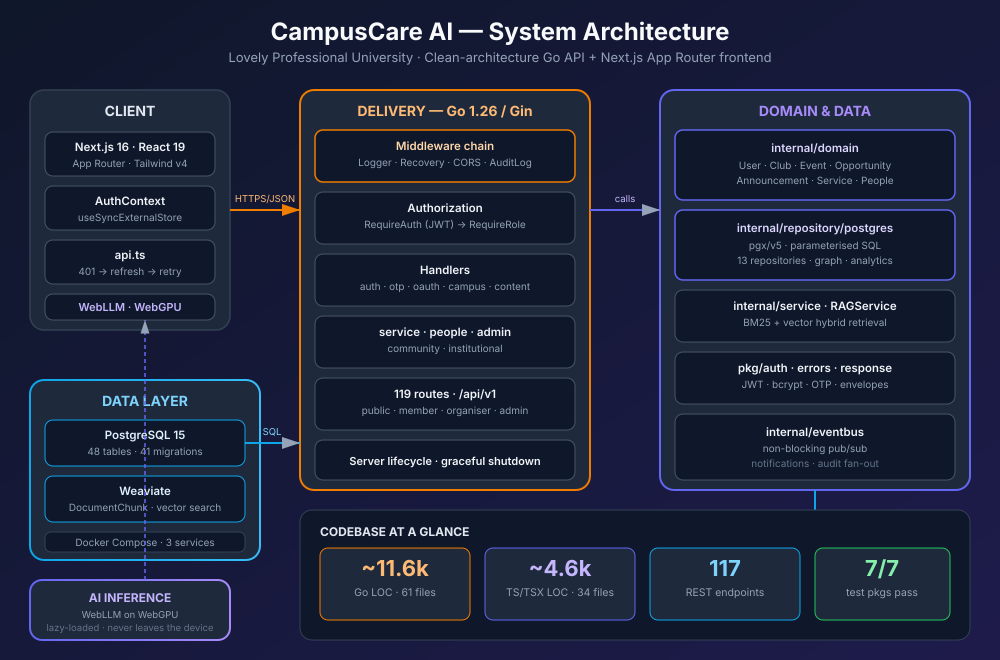

### Layer Responsibilities

| Layer | Package | Responsibility |
| --- | --- | --- |
| **Entrypoints** | `cmd/api`, `cmd/migrate`, `cmd/seed` | Process composition only — no business logic |
| **Config** | `internal/config` | Env parsing with validation and fail-fast rules |
| **Domain** | `internal/domain` | Entities, request/response DTOs, validation, enums. Zero dependencies |
| **Delivery** | `internal/delivery/http` | Gin handlers, routing, middleware. No SQL |
| **Repository** | `internal/repository/postgres` | 13 repositories, all parameterised `pgx` queries |
| **Service** | `internal/service` | `RAGService` — cross-repository orchestration |
| **Support** | `internal/eventbus`, `internal/logger`, `internal/database` | Pub/sub, structured logging, pool lifecycle |
| **Shared** | `pkg/auth`, `pkg/errors`, `pkg/response` | JWT, bcrypt, OTP, error taxonomy, JSON envelopes |
| **Frontend** | `frontend/src` | Next.js App Router, all pages client components |

### Data Model

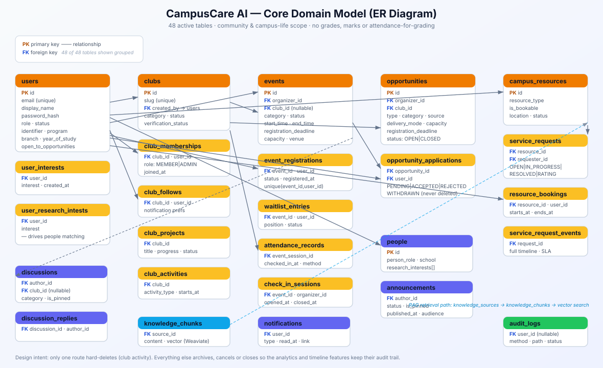

### Request Lifecycle

Every request through the API traverses the same chain:

```text
HTTP request
  +-> Logger            structured request logging
  +-> Recovery          panic recovery, returns JSON 500
  +-> CORS              explicit allow-list, not a wildcard
  +-> AuditLog          records POST/PUT/PATCH/DELETE to audit_logs
  +-> RequireAuth       validates the Bearer JWT, publishes userID + role
  +-> RequireRole       403 unless the role is in the allowed set
  +-> Handler           business logic + envelope
  +-> Repository        parameterised SQL
  +-> { success, message, data }
```

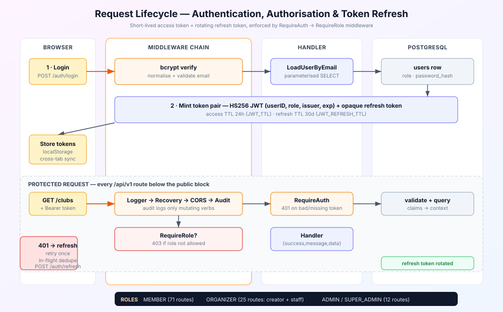

### Graceful Shutdown

`cmd/api` traps `SIGINT`/`SIGTERM`, then closes the PostgreSQL pool and calls
`http.Server.Shutdown` with a 10-second context. The server also starts if PostgreSQL is
unreachable, so the health endpoints remain observable while the database is coming up.

### AI & Privacy Architecture

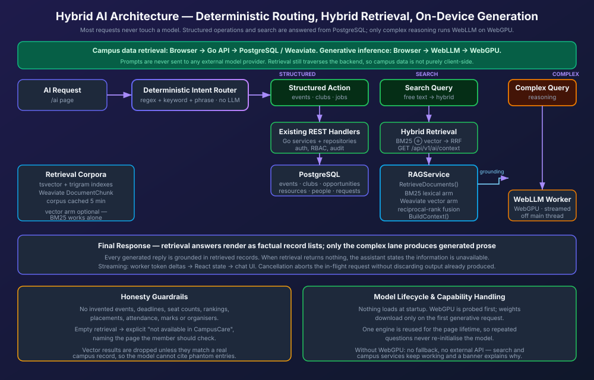

The AI layer is deliberately **not** a chat endpoint. A request is classified first by a
deterministic intent router, and only one of three paths runs:

| Route kind | Handling | Model used |
| --- | --- | --- |
| **Structured** | Sent to the existing REST handlers (`/events`, `/clubs`, `/opportunities`, `/community/resources`, …), which keep their normal auth, RBAC and audit behaviour | none |
| **Search** | Served by `GET /api/v1/ai/context`, a retrieval-only endpoint | none |
| **Complex** | Grounded with retrieved records first, then answered by WebLLM on WebGPU | WebLLM |

Because routing is deterministic, an ordinary question like *"show me events"* or *"book a study
room"* is answered from PostgreSQL by the same code paths as the rest of the app — no model weights
are downloaded and no prompt is generated.

Retrieval is hybrid. `internal/service/search` scores the campus corpus with BM25 (with SQL
`tsvector`/`pg_trgm` support for candidate selection) and, when Weaviate is reachable, fuses the
semantic arm with the lexical one using reciprocal-rank fusion. Weaviate is optional: if the
container is down the API logs why at start-up and serves the BM25 arm alone.

**The privacy claim is narrower, and therefore honest.** No third-party model provider key exists in
this repository — no OpenAI, Anthropic or Gemini credential appears anywhere in the codebase. When
WebLLM generates a reply, the prompt and the model weights stay on the user's device. Retrieval is
different: campus records are read through the authenticated Go API, so the query text does travel
to your own backend and database. The README does not claim otherwise.

**WebGPU is required for generation.** If `navigator.gpu` is missing the AI page explains why and
keeps search and structured actions working; there is no fallback to a hosted model.

---

## Technology Stack

### Backend

| Technology | Version | Purpose |
| --- | --- | --- |
| **Go** | 1.26 | Runtime |
| **Gin** | v1.12 | HTTP router and middleware |
| **pgx/v5** | v5.11 | PostgreSQL driver, connection pool, parameterised queries |
| **golang-jwt/jwt/v5** | v5.3 | HS256 access tokens |
| **golang.org/x/crypto** | v0.57 | bcrypt password hashing |
| **golang.org/x/oauth2** | v0.37 | Google OAuth 2.0 |
| **google/uuid** | v1.6 | Identifier generation |
| **sirupsen/logrus** | v1.10 | Structured logging |
| **joho/godotenv** | v1.5 | `.env` loading |
| **Weaviate Go client** | v4.16 | Vector similarity search for RAG |

### Frontend

| Technology | Version | Purpose |
| --- | --- | --- |
| **Next.js** | 16.3.8 | App Router, Turbopack |
| **React** | 19.2.8 | UI runtime |
| **TypeScript** | 5.x | Type safety, `strict` mode |
| **Tailwind CSS** | 4.x | Utility styling with `@theme inline` tokens |
| **@mlc-ai/web-llm** | 0.2.85 | In-browser LLM inference |
| **clsx** + **tailwind-merge** | 2 / 3 | Conditional class composition |
| **Vitest** | 3.2 | Frontend unit tests |
| **ESLint** | 9 | Linting, `eslint-config-next` |

### Infrastructure

| Technology | Version | Purpose |
| --- | --- | --- |
| **PostgreSQL** | 15-alpine | Primary datastore |
| **Weaviate** | 1.24.1 | Vector store for retrieval |
| **Docker** | Multi-stage | `golang:1.26-alpine` build to `alpine` runtime, non-root |
| **Docker Compose** | 3.8 | Postgres + API + Weaviate orchestration |
| **GitHub Actions** | — | CI: build, vet, test, typecheck, lint, build |

---

## Quick Start

The fastest path from a clean checkout to a running, seeded application.

### Prerequisites

| Requirement | Version | Check with |
| --- | --- | --- |
| Go | 1.26+ | `go version` |
| Node.js | 22+ | `node -v` |
| PostgreSQL | 15+ | `psql --version` |
| Docker Desktop | Any recent | `docker --version` *(only for the Compose route)* |

### Option A — Everything in Docker

```bash
git clone https://github.com/phanindra267/CampusFlow-Ai.git
cd CampusFlow-Ai

# Start PostgreSQL, the API and Weaviate
docker compose up -d
docker compose logs -f api
```

Then, from your host terminal:

```bash
# Apply all 37 migrations
go run ./cmd/migrate -direction up

# Load the demo campus
go run ./cmd/seed
```

### Option B — Local development

```bash
# 1. Clone and configure
git clone https://github.com/phanindra267/CampusFlow-Ai.git
cd CampusFlow-Ai
cp .env.example .env          # defaults work for local development

# 2. Create the database (or use `docker compose up -d db` instead)
createdb campuscare

# 3. Apply migrations
make migrate-up               # or: go run ./cmd/migrate -direction up

# 4. Load the demo campus
go run ./cmd/seed

# 5. Start the API on :8080
make run                      # or: go run ./cmd/api

# 6. In a second terminal, start the frontend on :3000
make frontend-install         # or: npm --prefix frontend install
make frontend-dev             # or: npm --prefix frontend run dev
```

Open **<http://localhost:3000>**.

### Verify the Setup

```bash
# Liveness — no database required
curl http://localhost:8080/api/v1/health/live

# Readiness — verifies the database
curl http://localhost:8080/api/v1/health/ready
```

### Demo / Login Credentials

**Login URL:** http://localhost:3000/login

The seed creates three accounts. **All share the password ChangeMe123!** and are inserted idempotently.

| Email | Password | Role | Access |
| --- | --- | --- | --- |
| dmin@campuscare.test | ChangeMe123! | ADMIN | Full admin console access |
| organiser@campuscare.test | ChangeMe123! | ORGANIZER | Event/org management |
| student@campuscare.test | ChangeMe123! | MEMBER | Student/member experience |

> Change or remove these before exposing a deployment anywhere.

### One-Command Start (Windows)

```powershell
.\start_all.ps1
```

Builds the API and starts both the Go backend and the Next.js dev server.

---

## Detailed Setup

### 1. Backend

```bash
# Resolve dependencies
go mod download

# Build
make build                     # -> bin/api

# Run all checks
make lint                      # gofmt + go vet
make test                      # full Go test suite

# Format
make fmt
```

### 2. Database

```bash
# Apply all pending migrations
make migrate-up

# Roll back the most recent migration
make migrate-down

# Apply a specific number of steps
go run ./cmd/migrate -direction up -steps 1

# Direction may also be given positionally
go run ./cmd/migrate up -steps 1
```

Each migration runs inside a transaction and is recorded in a `schema_migrations` table, so a
failed migration leaves no partial state. The runner uses `go:embed`, so the SQL travels inside the
binary — no files to mount and no path configuration in any environment.

### 3. Seed Demo Data

```bash
go run ./cmd/seed              # seeds an empty database
go run ./cmd/seed -force       # seeds even if content already exists
```

The seed loads seven campus services with FAQs, six clubs with activity histories, six events,
seven opportunities, six placeholder directory entries and three announcements. It invents no
real institutional facts: club names are generic and every person is explicitly labelled a sample
entry.

### 4. Frontend

```bash
cd frontend

npm install
npm run dev                    # -> http://localhost:3000

npm run lint                   # ESLint
npx tsc --noEmit               # typecheck
npm test                       # Vitest
npm run build                  # production build
npm start                      # serve the production build
```

Or drive it from the repo root with the `make frontend-*` targets.

### 5. Optional — Hybrid Semantic Arm

BM25 retrieval works with no extra setup. To enable the semantic arm, start the vector store:

```bash
docker compose up -d weaviate
```

The API probes Weaviate at start-up. If it is unreachable the vector arm is skipped and logged, and
`GET /api/v1/ai/context` keeps serving the BM25 arm.

---

## Configuration

All configuration is environment-based. Copy `.env.example` to `.env` for local development.

### Backend Variables

| Variable | Default | Description |
| --- | --- | --- |
| `APP_ENV` | `development` | `development`/`dev`/`local`/`test` enable the fallback JWT secret; anything else requires `JWT_SECRET` |
| `PORT` | `8080` | HTTP listen port |
| `JWT_SECRET` | — | **Required in production.** Minimum 32 characters; startup fails otherwise |
| `JWT_ISSUER` | `campuscare-api` | `iss` claim |
| `JWT_TTL` | `24h` | Access token lifetime (Go duration) |
| `JWT_REFRESH_TTL` | `720h` | Refresh token lifetime (30 days) |
| `CORS_ORIGINS` | `http://localhost:3000` | Comma-separated explicit allow-list |
| `LOG_LEVEL` | `info` | Log verbosity |
| `LOG_FORMAT` | `json` | `json` or `text` |
| `WEAVIATE_HOST` | `localhost:8081` | Vector store host (optional; BM25 alone if unreachable). Compose publishes Weaviate on 8081 |
| `WEAVIATE_SCHEME` | `http` | Vector store scheme |
| `DB_HOST` | `localhost` | PostgreSQL host |
| `DB_PORT` | `5432` | PostgreSQL port |
| `DB_USER` | `postgres` | PostgreSQL user |
| `DB_PASSWORD` | `postgres` | PostgreSQL password |
| `DB_NAME` | `campuscare` | Database name |
| `DB_SSLMODE` | `disable` | Set to `require` in production |
| `GOOGLE_CLIENT_ID` | — | Enables Google OAuth when all three are set |
| `GOOGLE_CLIENT_SECRET` | — | Google OAuth secret |
| `GOOGLE_REDIRECT_URL` | — | Must match the Google Cloud console entry |

### Frontend Variables

| Variable | Default | Description |
| --- | --- | --- |
| `NEXT_PUBLIC_API_URL` | `http://localhost:8080/api/v1` | API base URL |
| `NEXT_PUBLIC_WEBLLM_MODEL` | `Qwen2.5-0.5B-Instruct-q4f16_1-MLC` | WebLLM prebuilt model id |
| `NEXT_PUBLIC_WEBLLM_CONTEXT_WINDOW` | `4096` | Context window requested from the engine |
| `NEXT_PUBLIC_WEBLLM_TEMPERATURE` | `0.7` | Sampling temperature |
| `NEXT_PUBLIC_WEBLLM_TOP_P` | `0.95` | Nucleus sampling cutoff |
| `NEXT_PUBLIC_WEBLLM_MAX_TOKENS` | `512` | Cap on generated tokens per reply |

Model weights are fetched from the WebLLM public weight host on first generative use and cached by
the browser afterwards. That is a static asset download, not a model API call — no prompt is
transmitted.

### Fail-Fast Rules

Configuration is validated at startup rather than failing later at the first request:

- `JWT_SECRET` **must** be set when `APP_ENV` is not a development value — the process refuses to
  start with the built-in fallback secret
- `JWT_SECRET` must be **at least 32 characters**
- Invalid duration strings fall back to defaults rather than taking the process down
- Google OAuth reports `501 Not Implemented` when unconfigured, instead of attempting an exchange
  that cannot succeed

### Production Checklist

```bash
APP_ENV=production
DB_SSLMODE=require
JWT_SECRET=<a 64-character random string>
CORS_ORIGINS=https://campuscare.example.edu
LOG_FORMAT=json
```

---

## Usage Examples

All examples assume:

```bash
export BASE=http://localhost:8080/api/v1
export TOKEN="<access_token from login>"
```

### Authenticate

```bash
# Login
curl -X POST $BASE/auth/login \
  -H "Content-Type: application/json" \
  -d '{"email":"admin@campuscare.test","password":"ChangeMe123!"}'
```

```json
{
  "success": true,
  "message": "login successful",
  "data": {
    "access_token": "eyJhbGciOiJIUzI1NiIs...",
    "refresh_token": "8f3c1a...",
    "user": { "id": "...", "email": "admin@campuscare.test", "role": "ADMIN" }
  }
}
```

```bash
# Refresh an expired access token
curl -X POST $BASE/auth/refresh \
  -H "Content-Type: application/json" \
  -d '{"refresh_token":"8f3c1a..."}'

# Current identity
curl $BASE/auth/me -H "Authorization: Bearer $TOKEN"

# The aggregate profile view (clubs, saved, applications, requests)
curl $BASE/auth/profile -H "Authorization: Bearer $TOKEN"

# Register a new account (always provisioned as MEMBER)
curl -X POST $BASE/auth/register \
  -H "Content-Type: application/json" \
  -d '{"email":"new.student@lpu.edu.in","password":"Str0ngPass!"}'
```

### Browse and Participate

```bash
# Upcoming events, filtered by category
curl "$BASE/events?category=TECHNICAL" -H "Authorization: Bearer $TOKEN"

# Register, then save and set a reminder
curl -X POST $BASE/events/EVENT_ID/register -H "Authorization: Bearer $TOKEN"
curl -X POST $BASE/events/EVENT_ID/save     -H "Authorization: Bearer $TOKEN"
curl -X PUT  $BASE/events/EVENT_ID/reminder -H "Authorization: Bearer $TOKEN" \
  -H "Content-Type: application/json" \
  -d '{"remind_at":"2026-10-20T09:00:00Z"}'

# Join a club
curl -X POST $BASE/clubs/CLUB_ID/join -H "Authorization: Bearer $TOKEN"

# Start a discussion
curl -X POST $BASE/community/discussions \
  -H "Authorization: Bearer $TOKEN" -H "Content-Type: application/json" \
  -d '{"title":"Ideas for the next hackathon","body":"...","category":"GENERAL"}'
```

### Opportunities and Career

```bash
# List open opportunities
curl "$BASE/opportunities?category=TECHNICAL" -H "Authorization: Bearer $TOKEN"

# Apply, then withdraw (withdraw flips status; it never deletes)
curl -X POST   $BASE/opportunities/OPP_ID/apply -H "Authorization: Bearer $TOKEN"
curl -X DELETE $BASE/opportunities/OPP_ID/apply -H "Authorization: Bearer $TOKEN"

# Track your own applications
curl $BASE/me/opportunities -H "Authorization: Bearer $TOKEN"
```

### Service Desk

```bash
# File a ticket
curl -X POST $BASE/service-requests \
  -H "Authorization: Bearer $TOKEN" -H "Content-Type: application/json" \
  -d '{"resource_id":"RESOURCE_ID","subject":"Hostel Wi-Fi","description":"Not connecting in Block A"}'

# Follow the timeline
curl $BASE/service-requests/REQUEST_ID -H "Authorization: Bearer $TOKEN"

# Rate the resolution
curl -X POST $BASE/service-requests/REQUEST_ID/rating \
  -H "Authorization: Bearer $TOKEN" -H "Content-Type: application/json" \
  -d '{"rating":5,"comment":"Resolved the same day."}'
```

### Administration

```bash
export ADMIN_TOKEN="<access_token for admin@campuscare.test>"

# Campus analytics over 30 days
curl "$BASE/institutional/analytics?days=30" -H "Authorization: Bearer $ADMIN_TOKEN"

# Service queue and queue statistics
curl "$BASE/admin/service-requests?limit=100" -H "Authorization: Bearer $ADMIN_TOKEN"
curl $BASE/admin/service-requests/queue-stats -H "Authorization: Bearer $ADMIN_TOKEN"

# Resolve a ticket (a resolution note is mandatory)
curl -X PATCH $BASE/admin/service-requests/REQUEST_ID \
  -H "Authorization: Bearer $ADMIN_TOKEN" -H "Content-Type: application/json" \
  -d '{"status":"RESOLVED","resolution_note":"Replaced the access point in Block A."}'

# Verify a club
curl -X PATCH $BASE/admin/approvals/clubs/CLUB_ID \
  -H "Authorization: Bearer $ADMIN_TOKEN" -H "Content-Type: application/json" \
  -d '{"verification_status":"VERIFIED"}'
```

### Research Matching

```bash
# Find people by research interest
curl "$BASE/people/by-interest?interest=Machine%20Learning" -H "Authorization: Bearer $TOKEN"

# Find members whose interests overlap yours
curl "$BASE/people/matches" -H "Authorization: Bearer $TOKEN"

# Curate your own interests
curl -X POST $BASE/me/research-interests \
  -H "Authorization: Bearer $TOKEN" -H "Content-Type: application/json" \
  -d '{"interest":"Distributed Systems"}'
```

### Organiser Workflow

```bash
export ORG_TOKEN="<access_token for organiser@campuscare.test>"

# Your events and their analytics
curl $BASE/organiser/events -H "Authorization: Bearer $ORG_TOKEN"
curl $BASE/organiser/events/EVENT_ID/analytics -H "Authorization: Bearer $ORG_TOKEN"

# Open a check-in session, then read the attendance list
curl -X POST $BASE/organiser/sessions/SESSION_ID/check-in/open \
  -H "Authorization: Bearer $ORG_TOKEN"
curl $BASE/organiser/sessions/SESSION_ID/attendance -H "Authorization: Bearer $ORG_TOKEN"

# Publish an event
curl -X POST $BASE/events \
  -H "Authorization: Bearer $ORG_TOKEN" -H "Content-Type: application/json" \
  -d '{"title":"Intro to version control","description":"...","category":"WORKSHOP","venue":"Computer Lab 2","start_time":"2026-11-02T10:00:00Z","end_time":"2026-11-02T12:00:00Z","registration_deadline":"2026-11-01T12:00:00Z","capacity":40}'
```

### Using the AI Page

1. Open **<http://localhost:3000/ai>**
2. Ask in your own words — *"events this week"*, *"find research in NLP"*, *"book a study room"*.
   The banner above the transcript shows how the request was routed:
   - **Structured** → answered straight from the campus database, no model involved
   - **Search** → answered from hybrid retrieval, no model involved
   - **Complex** → grounded with retrieved records, then generated by WebLLM
3. Nothing is downloaded until the first **Complex** request; a progress bar reports the weight transfer
4. If the browser has no WebGPU, a banner says so and the first two modes keep working
5. Tokens stream in live; **Stop** cancels mid-generation

---

## Project Structure

```text
campuscare-ai/
|-- cmd/                              # Entrypoints - composition only
|   |-- api/main.go                   #   API server + graceful shutdown
|   |-- migrate/main.go               #   Embedded migration runner
|   `-- seed/main.go                  #   Idempotent demo data loader
|
|-- internal/
|   |-- config/                       # Env parsing + validation
|   |   |-- config.go                 #   Load(), fail-fast rules
|   |   |-- oauth.go                  #   Google OAuth client
|   |   `-- config_test.go
|   |
|   |-- domain/                       # Pure domain layer (no dependencies)
|   |   |-- user.go                   #   User, Profile, auth DTOs
|   |   |-- club.go                   #   Club, membership, activities
|   |   |-- event.go                  #   Event, registration, waitlist
|   |   |-- opportunity.go            #   Opportunity, applications
|   |   |-- announcement.go           #   Notices + scheduling
|   |   |-- community.go              #   Discussions, notifications
|   |   |-- service.go                #   Resources, requests, FAQs
|   |   |-- people.go                 #   Directory, research interests
|   |   `-- engagement.go             #   Activity + feedback
|   |
|   |-- delivery/http/
|   |   |-- handler/                  # 12 handlers
|   |   |   |-- auth.go  oauth.go  otp.go  health.go
|   |   |   |-- campus.go  content.go  community.go
|   |   |   |-- service.go  people.go  admin.go
|   |   |   |-- institutional.go
|   |   |   |-- ai.go                   #   Retrieval-only context endpoint
|   |   |   `-- *_test.go
|   |   `-- middleware/
|   |       |-- auth.go               #   RequireAuth, RequireRole
|   |       |-- audit.go              #   Mutating-request audit trail
|   |       |-- logger.go  recovery.go
|   |
|   |-- repository/postgres/          # 13 data-access repositories
|   |   |-- user_repo.go        profile_repo.go     tokens.go
|   |   |-- club_repo.go        campus_repo.go
|   |   |-- event_repo.go       opportunity_repo.go
|   |   |-- announcement_repo.go  notification_repo.go
|   |   |-- community_repo.go   people_repo.go
|   |   |-- service_repo.go     analytics_repo.go
|   |   `-- graph_repo.go
|   |
|   |-- service/
|   |   |-- rag_service.go             #   Hybrid retrieval + BuildContext
|   |   |-- rag_service_test.go
|   |   |-- corpus.go                  #   PostgreSQL corpus, cached 5 min
|   |   `-- search/                    #   BM25 + reciprocal-rank fusion
|   |       |-- bm25.go  bm25_test.go
|   |       `-- hybrid.go
|   |-- server/
|   |   |-- server.go                 # Lifecycle, CORS, timeouts
|   |   |-- routes.go                 # 119 routes across 10 groups
|   |   `-- server_test.go
|   |-- database/postgres.go          # Pool lifecycle
|   |-- eventbus/bus.go               # Non-blocking pub/sub
|   |-- logger/logger.go              # Structured logging
|   `-- integration/                  # Route-graph integration tests
|       `-- community_api_test.go
|
|-- pkg/                              # Shared utilities
|   |-- auth/                         # jwt.go  password.go  transient.go
|   |-- errors/errors.go              # Error taxonomy
|   `-- response/response.go          # JSON envelope
|
|-- migrations/                       # 41 up SQL migrations
|   `-- embed.go                      # go:embed directive
|
|-- frontend/                         # Next.js 16 App Router
|   |-- src/
|   |   |-- app/
|   |   |   |-- (protected)/          # Auth-gated route group
|   |   |   |   |-- dashboard/  discover/  community/
|   |   |   |   |-- campus/  career/  research/
|   |   |   |   |-- ai/  notifications/  profile/
|   |   |   |   `-- admin/            # users, analytics, approvals, operations
|   |   |   |-- login/  layout.tsx  page.tsx  globals.css
|   |   |-- components/
|   |   |   |-- admin/AdminPages.tsx
|   |   |   |-- ai/AIComponents.tsx
|   |   |   |-- layout/Navigation.tsx
|   |   |   `-- ui/                   # Button, Badge, Skeleton
|   |   |-- contexts/AuthContext.tsx
|   |   |-- hooks/                    # useAsyncData, useLLM
|   |   |-- lib/
|   |   |   |-- api.ts                # Typed client, 401 refresh+retry
|   |   |   |-- api.test.ts
|   |   |   |-- ai/                   # router.ts + privacy.test.ts
|   |   |   `-- llm/                  # WebLLM worker runtime
|   |   |       |-- config.ts  index.ts  types.ts  protocol.ts
|   |   |       |-- engine.ts  webllm.worker.ts
|   |   `-- lib/utils.ts
|   |-- package.json  tsconfig.json
|   |-- tailwind.config.ts  eslint.config.mjs
|   `-- next.config.ts
|
|-- docs/                             # Diagrams + capture guide
|   |-- architecture.svg  er-diagram.svg  request-flow.svg
|   |-- ai-pipeline.svg  user-journey.svg
|   |-- SCREENSHOTS.md
|   `-- screenshots/
|
|-- .github/workflows/ci.yml          # CI pipeline
|-- docker-compose.yml                # db + api + weaviate
|-- Dockerfile                        # Multi-stage, non-root
|-- Makefile                          # Developer task runner
|-- start_all.ps1                     # Windows one-command start
|-- .env.example
`-- README.md
```

---

## API Reference

**Base URL:** `http://localhost:8080/api/v1`

### Access Levels

| Level | Routes | Roles |
| --- | --- | --- |
| **Public** | 9 | None |
| **Member** | 71 | Any authenticated account |
| **Organiser** | 10 | `ORGANIZER`, `ADMIN`, `SUPER_ADMIN` |
| **Creator** | 13 | `ORGANIZER`, `ADMIN`, `SUPER_ADMIN` |
| **Staff** | 2 | `ORGANIZER`, `ADMIN`, `SUPER_ADMIN` |
| **Admin** | 12 | `ADMIN`, `SUPER_ADMIN` |

### Public

```http
GET  /health/live                  # Liveness - no database required
GET  /health/ready                 # Readiness - verifies PostgreSQL
POST /auth/login
POST /auth/register
POST /auth/refresh                 # Unauthenticated by design: the token is in the body
POST /auth/otp/request
POST /auth/otp/verify
GET  /auth/google
GET  /auth/google/callback
```

### Identity

```http
GET   /auth/me
PATCH /auth/me                     # Partial update; pointers distinguish "clear" from "unchanged"
GET   /auth/profile                # Aggregate view: 9-query fan-out of every collection
```

### Community

```http
GET    /community/search
GET    /community/discussions
POST   /community/discussions
GET    /community/discussions/:id
POST   /community/discussions/:id/replies
GET    /community/notifications
POST   /community/notifications/:id/read
POST   /community/notifications/read-all
GET    /community/services
POST   /community/services/:id/bookings
GET    /community/bookings
DELETE /community/bookings/:id
```

### Clubs, Events & Opportunities

```http
GET    /clubs                       GET    /clubs/categories
GET    /clubs/:id                   GET    /clubs/:id/activities
GET    /clubs/:id/projects          POST   /clubs/:id/join
POST   /clubs/:id/leave             POST   /clubs/:id/follow
DELETE /clubs/:id/follow

GET    /events                      GET    /events/categories
GET    /events/:id                  GET    /events/:id/waitlist
POST   /events/:id/register         POST   /events/:id/cancel
POST   /events/:id/save             DELETE /events/:id/save
PUT    /events/:id/reminder         DELETE /events/:id/reminder
POST   /events/check-in             # Door scanning; static segment wins over :id

GET    /opportunities               GET    /opportunities/categories
GET    /opportunities/types         GET    /opportunities/:id
POST   /opportunities/:id/save      DELETE /opportunities/:id/save
POST   /opportunities/:id/apply     DELETE /opportunities/:id/apply   # withdraw

POST   /feedback/:type/:id
```

### Service Desk & People

```http
POST   /service-requests            GET    /service-requests/:id
POST   /service-requests/:id/messages
POST   /service-requests/:id/rating
POST   /service-requests/:id/attachments
GET    /services/:id/faqs
POST   /services/:id/faqs           DELETE /services/:id/faqs/:faqId    # staff

GET    /people                     GET    /people/schools
GET    /people/research-interests  GET    /people/by-interest
GET    /people/matches             GET    /people/:id
```

### Personal Collections (`/me`)

```http
GET   /me/notifications            GET   /me/clubs
GET   /me/opportunities            GET   /me/following
GET   /me/bookings                 GET   /me/saved-events
GET   /me/activity                 GET   /me/service-requests
GET   /me/notification-preferences PATCH /me/notification-preferences
GET   /me/research-interests       POST  /me/research-interests
DELETE /me/research-interests/:interest
```

`/me` is registered as three separate groups to keep personal collections from colliding with
the `:id` routes of the collection groups.

### Organiser & Creator

```http
POST  /organiser/sessions/:id/check-in/open
GET   /organiser/sessions/:id/attendance
GET   /organiser/events            GET   /organiser/events/:id/analytics
GET   /organiser/events/:id/registrations
POST  /organiser/events/:id/waitlist/promote
GET   /organiser/opportunities/:id/applications
PATCH /organiser/opportunities/:id/applications/:applicationId
GET   /organiser/opportunities/:id/analytics
GET   /organiser/clubs/:id/analytics

POST   /events                      PATCH /events/:id           DELETE /events/:id
POST   /clubs                       PATCH /clubs/:id            DELETE /clubs/:id
POST   /clubs/:id/activities        DELETE /clubs/:id/activities/:activityId
POST   /clubs/:id/projects          PATCH /clubs/:id/projects/:projectId
POST   /opportunities               PATCH /opportunities/:id    DELETE /opportunities/:id
```

### Admin & Institutional

```http
GET   /admin/users                 GET   /admin/approvals/clubs
PATCH /admin/approvals/clubs/:id
POST  /admin/announcements         PATCH /admin/announcements/:id
GET   /admin/service-requests      PATCH /admin/service-requests/:id
GET   /admin/service-requests/queue-stats
POST  /admin/people                PATCH /admin/people/:id
GET   /institutional/analytics     GET   /institutional/graph
GET   /announcements               GET   /announcements/:id
```

### Response Envelope

Every endpoint returns a consistent envelope.

```json
{ "success": true, "message": "...", "data": { } }
```

```json
{ "success": false, "error": "insufficient permissions", "details": "" }
```

`details` carries the underlying error string when one is available, and is empty otherwise.

| Status | Meaning |
| --- | --- |
| `200` / `201` | Success |
| `400` | Validation failure |
| `401` | Missing, malformed or expired token |
| `403` | Authenticated but lacking the required role |
| `404` | Not found |
| `409` | Conflict |
| `501` | Feature not configured (e.g. Google OAuth unset) |

---

## Database & Migrations

### Migrations

SQL files live in `migrations/` and are embedded into the binary with `go:embed`, so no files
need mounting in any deployment.

```bash
make migrate-up                              # apply all pending
make migrate-down                            # roll back one step
go run ./cmd/migrate -direction up -steps 1  # apply the next pending migration
go run ./cmd/migrate down -steps 1           # direction may also be positional
```

**37** up migrations and **9** down migrations. Note that migrations `000004`-`000032` created a
large speculative surface, which migration `000039` then removed — it dropped **111** unused
tables that no Go code read, leaving a schema that honestly reflects what the application actually
does. That migration is intentionally one-way; recreating a hundred tables is not something a
rollback should attempt.

### Active Schema — 48 Tables

| Domain | Tables |
| --- | --- |
| **Identity** | `users`, `tenants`, `campuses`, `user_interests`, `user_research_interests`, `user_skills`, `user_connections`, `skills`, `organizer_profiles` |
| **Clubs** | `clubs`, `club_memberships`, `club_follows`, `club_activities`, `club_projects`, `club_announcements` |
| **Events** | `events`, `event_sessions`, `event_registrations`, `waitlist_entries`, `attendance_records`, `event_reminders`, `saved_events` |
| **Opportunities** | `opportunities`, `opportunity_applications`, `saved_opportunities` |
| **Services** | `campus_resources`, `resource_bookings`, `service_requests`, `service_request_events`, `service_request_attachments`, `service_faqs` |
| **Community** | `discussions`, `discussion_replies`, `notifications`, `notification_preferences`, `announcements`, `feedback`, `engagement_activities` |
| **People** | `people` |
| **Intelligence** | `graph_nodes`, `graph_edges`, `knowledge_sources`, `knowledge_chunks`, `conversations`, `messages`, `message_citations` |
| **Governance** | `audit_logs` |

### Design Decisions

**Archive, don't delete.** Only one endpoint hard-deletes: removing a club activity. Events are
cancelled, opportunities closed, clubs archived. This preserves the history that the analytics
and timeline features depend on.

**Soft lifecycle states everywhere.** Withdrawing an application sets `WITHDRAWN`; it never
deletes a row. Resolving a ticket keeps every prior state change in its timeline.

**Denormalised counters.** Clubs carry `follower_count` and `member_count` rather than computing
them per request, because the listing pages need them on every card.

**`SELECT ... FOR UPDATE` on queue claims.** Two staff members cannot claim the same service
ticket concurrently.

---

## Frontend Guide

### Routes

| Route | Purpose |
| --- | --- |
| `/` | Redirect shim to `/dashboard` or `/login` |
| `/login` | Split-screen sign-in with email/password |
| `/dashboard` | Role-split home: member greeting, or admin campus overview |
| `/discover` | Events and groups with category filters |
| `/community` | Discussions and groups; deep-links via `?discussion=<id>` |
| `/campus` | Campus services, resource booking, booking management |
| `/career` | Opportunities, applications, interview preparation |
| `/research` | Open projects and research groups |
| `/ai` | Streaming AI assistant |
| `/notifications` | Notification centre with optimistic mark-as-read |
| `/profile` | Personal details, settings, privacy |
| `/admin/users` | Member administration |
| `/admin/analytics` | Campus analytics |
| `/admin/approvals` | Club verification |
| `/admin/operations` | Service desk queue |

The `(protected)` layout group gates every authenticated route, redirects to `/login` when no
session exists, and composes the desktop sidebar, top bar and mobile bottom navigation.

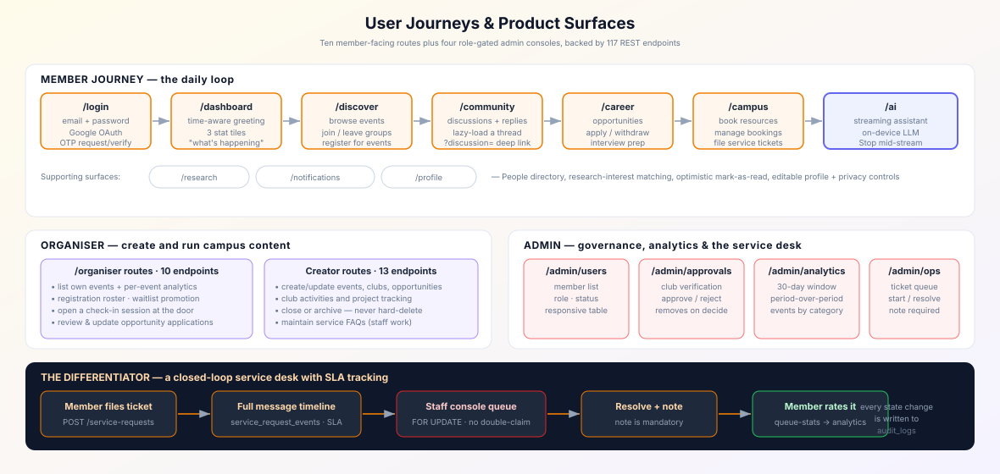

### Architecture Notes

**Auth is an external store, not React state.** `AuthContext` implements `useSyncExternalStore`
over a `localStorage`-backed store with a manually cached snapshot. This makes auth correct under
concurrent rendering, and the `storage` event listener propagates sign-out across browser tabs.
`getServerSnapshot` returns `null`, which is what drives the hydration gate.

**One data-fetching hook.** `useAsyncData` returns `{ data, error, isLoading, refresh, setData }`,
guards against `setState`-after-unmount, and re-runs when its `deps` change. Exposing `setData`
is what makes optimistic updates possible across mark-as-read, join/leave, booking cancellation
and admin approvals — each rolls back to a refetch on failure.

**Token refresh is transparent.** `api.ts` intercepts any `401`, refreshes once, and retries the
original request exactly once. An in-flight refresh promise is shared so that parallel page
requests cannot race and burn the refresh token.

**Styling.** Tailwind v4 with design tokens defined in `globals.css` via `@theme inline`, exposed
as a CSS custom property layer. LPU orange `#F07C00` is the brand primary; indigo `#6366F1` is
reserved exclusively for AI surfaces. There is a large global interaction layer built on element
selectors — hover lift, focus rings, card transitions — and every animation is fully disabled
under `prefers-reduced-motion: reduce`.

**Accessibility.** A global `:focus-visible` ring, semantic `<label>` associations on all inputs,
`aria-label` on icon-only controls, `role="alert"` on error banners, status always conveyed by
text as well as colour, and `en-IN` date formatting.

See [`frontend/README.md`](frontend/README.md) for frontend-specific detail.

---

## Testing

### Running Tests

```bash
make test                      # Go - all packages
go test -count=1 ./cmd/... ./internal/... ./pkg/...

cd frontend
npm test                       # Vitest
npx tsc --noEmit               # typecheck
npm run lint                   # ESLint
```

### Current Status

```text
ok  github.com/campuscare/api/internal/config                  0.130s
ok  github.com/campuscare/api/internal/delivery/http/handler    0.348s
ok  github.com/campuscare/api/internal/server                   0.333s
ok  github.com/campuscare/api/pkg/auth                          0.118s
```

**4 test packages with tests, all passing.** `go build`, `go vet` and `gofmt` are all clean.

### Coverage

| Suite | What it verifies |
| --- | --- |
| `config_test.go` | Env parsing, defaults, fail-fast rules |
| `jwt_test.go` | Token signing, validation, expiry, tampering |
| `auth_test.go` | Registration, login, duplicate-email rejection, password policy |
| `health_test.go` | Liveness and readiness endpoints |
| `community_api_test.go` | Full route graph driven in-process over the real router |
| `server_test.go` | Route registration — duplicate paths would panic at construction |
| `api.test.ts` | Token storage, 401 refresh-and-retry, refresh-failure session clear |

`server_test.go` and `community_api_test.go` drive the real wired route graph in-process rather
than binding a TCP port, so route collisions and middleware regressions are caught by the test
suite rather than at runtime.

### Continuous Integration

`.github/workflows/ci.yml` runs on every push and pull request to `main`:

**Backend job** — `go build` -> `go vet` -> `go test -count=1 -v`

**Frontend job** — `npm ci` -> `tsc --noEmit` -> `npm run lint` -> `npm run build`

---

## Deployment

### Docker

The `Dockerfile` is a two-stage build: `golang:1.26-alpine` compiles a static, stripped,
`CGO_ENABLED=0` binary, which is copied into a minimal `alpine` image running as `nobody`.

```bash
docker build -t campuscare-api .
docker run -p 8080:8080 --env-file .env campuscare-api
```

### Docker Compose

Brings up PostgreSQL, the API and Weaviate together:

```bash
docker compose up -d
docker compose ps
docker compose logs -f api
docker compose down -v      # stop and drop the volume
```

### Make Targets

```text
make help                     List every target

Backend
  make run                    Start the API server
  make build                  Compile to bin/api
  make test                   Run the Go test suite
  make vet                    Run go vet
  make lint                   gofmt + go vet checks
  make fmt                    Format Go sources
  make migrate-up             Apply pending migrations
  make migrate-down           Roll back the most recent migration

Frontend
  make frontend-install       Install dependencies
  make frontend-dev           Start the dev server
  make frontend-build         Production build
  make frontend-lint          Lint
  make frontend-typecheck     Type-check

  make clean                  Remove build artefacts
```

### Production Checklist

- [ ] Set `APP_ENV=production`
- [ ] Set a strong `JWT_SECRET` (32+ characters) — startup refuses the fallback otherwise
- [ ] Set `DB_SSLMODE=require`
- [ ] Restrict `CORS_ORIGINS` to the real frontend origin — never `*`
- [ ] Remove or rotate the seeded demo accounts
- [ ] Replace the placeholder people-directory entries with real data, or remove the feature
- [ ] Confirm `LOG_FORMAT=json` for log aggregation
- [ ] Run `go vet`, `gofmt`, `tsc --noEmit` and `npm run lint` before deploying

---

## Security

### Implemented

| Control | Implementation |
| --- | --- |
| **Password hashing** | bcrypt at default cost; hashes are never serialised (`json:"-"`) |
| **Token integrity** | HS256 JWT with issuer and expiry validation; a tampered token fails signature checks |
| **Secret strength** | `JWT_SECRET` must be 32+ characters; production refuses the development fallback |
| **Parameterised SQL** | Every query uses pgx placeholders — no string-concatenated user input |
| **Explicit CORS** | A configured allow-list with `Vary: Origin`, not a wildcard |
| **Role enforcement** | `RequireAuth` then `RequireRole` at the route group; ownership is re-checked inside handlers |
| **Audit trail** | Every mutating request is recorded to `audit_logs` with actor, method, path, status and latency |
| **Panic recovery** | A recovery middleware converts panics into JSON 500 responses |
| **Request timeouts** | 15s read/write, 5s read-header, 60s idle |
| **Container hardening** | The image runs as `nobody` with `ca-certificates` and `tzdata` only |
| **Status codes** | `401` for authentication failures, `403` for authorisation failures — correctly distinguished |
| **OAuth CSRF** | The `state` parameter is issued with a 10-minute TTL |
| **Booking integrity** | Overlapping resource bookings are refused, not silently double-booked |

### Client-Side Notes

Admin pages are gated by an `AdminOnly` client component for user experience, but **real
authorization lives in the API** — the client gate is cosmetic and the middleware is the actual
control. `localStorage` token storage is a deliberate trade-off: it enables the seamless refresh
and cross-tab session sync, but a successful XSS would expose the token, so the frontend ships no
`dangerouslySetInnerHTML` and no untrusted HTML rendering.

---

## Design Principles

These decisions are load-bearing. They are not accidental.

**The AI never invents facts.** Most requests are answered without any model: the deterministic
router sends structured requests to existing REST handlers and search requests to retrieval. When
generation does happen, it is grounded in retrieved campus records first, and the system prompt
forbids fabricating events, deadlines, seat counts, organiser names or placement statistics. If
retrieval finds nothing, the assistant says the information is not available instead of guessing.
The Career page states plainly that no match scores or placement statistics are published.

**No cloud AI provider.** This is structural, not a policy: no third-party model credential exists
anywhere in the repository. Generation runs on the browser's WebGPU engine, so the prompt stays on
the user's device. Retrieval does go through the authenticated Go API, and the documentation says so
rather than claiming campus data is client-side.

**Public registration cannot escalate.** The role field in a registration request is accepted and
ignored. Every self-registered account is a `MEMBER`. Elevation is an out-of-band administrative
action.

**Only one endpoint hard-deletes.** Everything else archives, cancels or closes, because the
analytics and timeline features depend on retained history.

**Withdrawal is not deletion.** Withdrawing an application flips it to `WITHDRAWN` so the record
survives.

**Resolving a ticket requires a note.** The admin UI enforces a non-empty resolution note, so the
member's timeline is never closed with an empty answer.

**Seed data invents no real facts.** Club names are generic, and every directory entry is
explicitly labelled a sample. A demo that names real-looking staff puts words in the mouths of
people who never agreed to it.

**The platform is a community, not an academic record.** There are no marks, grades, or
attendance-for-grading fields anywhere in the schema, and no `FACULTY` role exists.

---

## Known Gaps & Limitations

Documented honestly, because a README that claims completeness is less useful than one that
tells you where the edges are.

| Gap | Detail | Impact |
| --- | --- | --- |
| **No rate limiting** | There is no throttling middleware and no limiter dependency. `/auth/login`, `/auth/otp/request` and `/auth/google` are unauthenticated | Credentials and OTP endpoints are brute-forceable. `golang.org/x/time/rate` is the fix |
| **Dark mode is scaffolded but inactive** | `darkMode: "class"`, a `.dark` token block and theme variables all exist, but `<html>` never receives the class, no toggle is wired, and pages hardcode light utilities | Enabling `.dark` today would produce a half-themed UI |
| **`Cmd-K` is decorative** | The top-bar search shows a keyboard hint and opens a command palette, but no key handler is bound, and the palette has no arrow-key navigation or `Esc` dismissal | Keyboard-only users cannot reach the palette |
| **Notification dot is static** | The top-bar bell always shows an unread indicator and the avatar initial is hardcoded | Cosmetic inaccuracy on the top bar |
| **Profile checkboxes are not persisted** | Notification and privacy toggles are uncontrolled and store nothing | Settings UI is non-functional |
| **Frontend test coverage is thin** | One test file covers the token lifecycle; there are no page or component tests | Regressions in page behaviour are not caught automatically |
| **Unused dependencies** | `lucide-react` is declared but never imported; `api.search()` and the `Skeleton` components are implemented but unused | Minor bundle and maintenance overhead |
| **Weaviate is optional but not wired to a route** | `RAGService` is implemented, but no endpoint currently calls it | Retrieval is built, not yet exposed |
| **Access-token TTL is long** | The 24-hour default weakens the refresh mechanism's value | Lower the `JWT_TTL` default for stricter deployments |

---

## Roadmap

Roughly in priority order, not committed dates.

- [x] Clean-architecture Go API with JWT + role middleware
- [x] PostgreSQL schema and embedded migration runner
- [x] Events, clubs, opportunities and announcements
- [x] Community discussions and notifications
- [x] Closed-loop service desk with SLA timelines and ratings
- [x] Resource booking with conflict refusal
- [x] People directory and research-interest matching
- [x] Institutional analytics and knowledge graph
- [x] Next.js frontend across ten member routes
- [x] Four role-gated admin consoles
- [x] Hybrid AI retrieval (BM25 + vector fusion) and on-device WebGPU generation
- [x] Docker, Docker Compose, CI
- [ ] Rate limiting on authentication endpoints
- [ ] Functional dark mode with a persisted preference
- [ ] Wire the `RAGService` retrieval behind an endpoint
- [ ] Replace the command-palette hint with a real global shortcut
- [ ] Persist notification and privacy preferences
- [ ] Component and page-level frontend tests
- [ ] Push and email notifications for event reminders
- [ ] Real calendar and email provider integrations
- [ ] Accessibility audit against WCAG 2.2 AA, including keyboard navigation of the command palette
- [ ] Replace the placeholder directory with real institutional data
- [ ] OpenTelemetry tracing across the request pipeline

---

## Contributors

| Contributor | Role | Contribution |
| --- | --- | --- |
| **Kakumani Phaneendra** | Developer | Full-stack architecture, Go API, PostgreSQL schema, Next.js frontend, on-device AI layer, Docker and CI |

[](https://github.com/phanindra267/CampusFlow-Ai/followers)

Contributions are welcome. Please read the [Design Principles](#design-principles) section first —
several deliberate constraints (archive-don't-delete, no invented AI facts, no cloud model
provider) exist for reasons that are easy to undo by accident.

---

## License

```text
MIT License

Copyright (c) 2026 CampusCare AI · Lovely Professional University

Permission is hereby granted, free of charge, to any person obtaining a copy
of this software and associated documentation files (the "Software"), to deal
in the Software without restriction, including without limitation the rights
to use, copy, modify, merge, publish, distribute, sublicense, and/or sell
copies of the Software, and to permit persons to whom the Software is
furnished to do so, subject to the following conditions:

The above copyright notice and this permission notice shall be included in all
copies or substantial portions of the Software.

THE SOFTWARE IS PROVIDED "AS IS", WITHOUT WARRANTY OF ANY KIND, EXPRESS OR
IMPLIED, INCLUDING BUT NOT LIMITED TO THE WARRANTIES OF MERCHANTABILITY,
FITNESS FOR A PARTICULAR PURPOSE AND NONINFRINGEMENT. IN NO EVENT SHALL THE
AUTHORS OR COPYRIGHT HOLDERS BE LIABLE FOR ANY CLAIM, DAMAGES OR OTHER
LIABILITY, WHETHER IN AN ACTION OF CONTRACT, TORT OR OTHERWISE, ARISING FROM,
OUT OF OR IN CONNECTION WITH THE SOFTWARE OR THE USE OR OTHER DEALINGS IN THE
SOFTWARE.
```

---

## Acknowledgements

- **Lovely Professional University** — for the campus context this platform was designed around
- **[Gin](https://gin-gonic.com)**, **[Next.js](https://nextjs.org)**, **[PostgreSQL](https://www.postgresql.org)**,
  **[Tailwind CSS](https://tailwindcss.com)**, **[pgx](https://github.com/jackc/pgx)**
- **[WebLLM](https://github.com/mlc-ai/web-llm)** — for making genuinely local LLM inference
  practical in a browser
- **[Weaviate](https://weaviate.io)** — vector search for the semantic arm of hybrid retrieval

> All seeded content is fictional demonstration data. Club names are generic and every directory
> entry is explicitly labelled a sample entry. Replace it with real content before using this
> platform in public.

---

<div align="center">

### Built with care at Lovely Professional University

**CampusCare AI** — *your intelligent campus companion*

[](https://go.dev)
[](https://nextjs.org)
[](https://www.postgresql.org)

[Report an issue](https://github.com/phanindra267/CampusFlow-Ai/issues) ·
[View source](https://github.com/phanindra267/CampusFlow-Ai) ·
[Back to top](#campuscare-ai)

</div>
